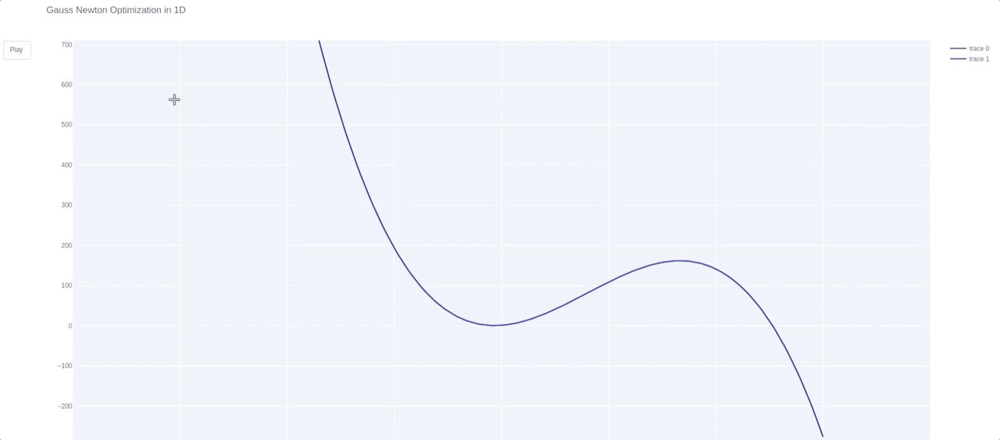

# 1D-Gauss-Newton-Optimization
Very simple Gauss Newton Optimizer in 1D with application on quadratic and 3rd order polynomial. Animation with Plotly

Dependencies: 
              
              python 3.7
              plotly 
              numpy
              
              
Usage: run main.py with the following options:

        --function_type (Quadratic or Polynomial (only 3rd degree supported) )
        --starting point (initial point to optimize from)
        --learning rate  (alpha parameter in front of the GN update)
        --a, --b, --c, --d  (factors to change the function parameters)
        --nbr_it (number of iterations to run the optimization for)
        
        
        

